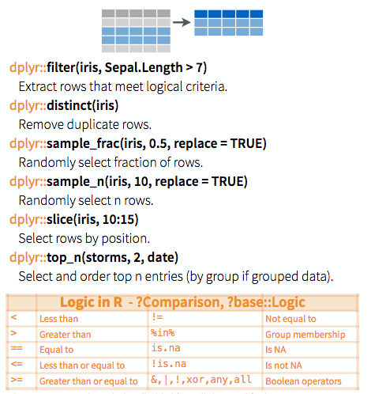
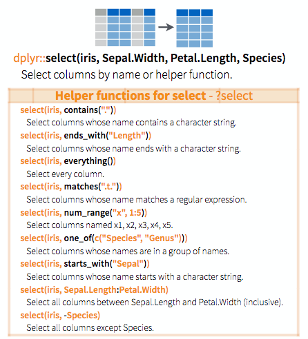

## Contents

- Good Enough Practices
- Review of session 1
  - Making a notebook
  - Names, operators, functions
  - Tidyverse installation
- Vectors and matrices
  - indexing
  - 2-dimensional indexes (matrix and data.frame)
- Flow control
  - loops
  - if-else
- Tabular data
  - read_tsv etc.
- **HOMEWORK**
  - Exercise: wrangling the Kelly data
  - Exercise: write a complex function with defaults

## Revision etc.

```{r}
getwd() # where RStudio thinks we are
list.files()
```

NOTE: better experiment with this in the console, notebooks don't like to change directories midstream
```{r}
setwd("/Users/micdu303/Dropbox/Work/Uppsala/teaching/visualisation-and-statistical-analysis/")
list.files()
```

## Functions

A more consise version of our function:
```{r}
get.hypotenuse <- function(a, b){sqrt(a^2 + b^2)}
get.hypotenuse(4,5)
```
Here's a function to get the volume of a sphere, (v = 4/3πr³):

```{r}
get.spherical.volume <- function(r) {4 / 3 * pi * (r ^ 3)}
get.spherical.volume(10)
```
Remember that if you change a chunk above you also have to run it before later chunks will have access to the changes. Note the "Run all chunks above" button (downward pointing triangle over a line) next to the "Run current chunk" button on the right side of the screen here in the markdown view
```{r}
get.hypotenuse(19, 13)
```
```{r}
get.cylindrical.volume <- function(r, h){
  h * pi * r ^ 2
}
get.cylindrical.volume(1, 10)
```

### Positional and keyword arguments

Positional arguments (R knows which argument is which by the position in the function call)
```{r}
my.func <- function(first_argument, second_argument, etc){
  #do something with first_argument, second_argument, etc
}
```

Arguments with default (use = in the function definition to give a default value)
```{r}
my.func <- function(radius, dimensions=2){
  if (dimensions == 2){
    pi * radius ^ 2
  } else if (dimensions == 3) {
    4 / 3 * pi * radius ^ 3
  } else {
    -999
  }
}

my.func(1)
my.func(1, 3)
my.func(1, 2)
```

Keyword arguments: specify the arguments in the function call (advantages: this is self-documenting, easier to know which argument is which; arguments can be given in any order) 
```{r}
my.func(dimensions=3, radius=1)
```


### The pipe operator

Import the tidyverse to use "pipes". 
```{r}
library(tidyverse)
```

With the pipe operator the item on the left is ‘sent’ to the next function as its first argument.

```{r}
sqrt(9)
```

With a pipe:
```{r}
9 %>% sqrt()
```
The pipe operator is functionally identical to a regular function call.

You can do crazy things with pipes:
```{r}
(3**2 + 4**2) %>% sqrt()
```

But you can also do very very sensible things, especially when working with tables. Here's a preview:

```{r eval=FALSE}
# you must load tidyverse first
write_csv(select(filter(read_csv("class_list.csv"), Course.code=="5LN139"), -Personnummer), "anon_class_list.csv")
```

i.e. horrible to read nested functions; they get even worse if the functions have multiple arguments
```{r eval=FALSE}
f(g(h(i(j("stuff")))))
f(g(h(i(j("stuff", type=char), junk=TRUE), foo=999), save=TRUE, blah="XXX"), verbose=FALSE)
```

Translating this into pipes, we get

```{r eval=FALSE}
read_csv("class_list.csv") %>% 
  filter(Course.code=="5LN139") %>% 
  select(-Personnummer) %>%
  write_csv("anon_class_list.csv")
  # this could all have been on one line
```

i.e 

1. read the csv file, and send the output to
2. the filter function, which chooses certain rows and send the output to
3. the select function, which (here) deletes an unwanted column, then send the output to
4. the write csv function, which puts the output into a new file

## Indexing vectors

Remember the built in vector `month.name`:

```{r}
month.name
```
Indexes are numbers pointing out which position in the position/s in the vector to choose. Indexes are written in square brackets after the thing they are indexing
```{r}
month.name[2]
```

Ranges
```{r}
month.name[1:3]
```

Use a vector of numerals as index
```{r}
month.name[c(1,4,9)]
```
Negative index to drop a value
```{r}
month.name[-4]
```

```{r}
month.name[c(-2,-11)]
```

It doesn't make sense to mix positive and negative integers.

Repeat indexes
```{r}
month.name[c(1,1,1,1,1,2,2)]
```

Vectors can be added together:
```{r}
a <- 1:6
b <- c(0,1,0,0,1,1)
a
b
a + b
a * b
```
Matrix

```{r}
matrix(0, nrow=4, ncol=3)
```
```{r}
m <- matrix(0, nrow=4, ncol=3)
m[2,3] <- 99
```
```{r}
n <- matrix(1:12, nrow=4, ncol=3)
n
```
```{r}
n + n
```

Data frame

a table with columns of the same length, each column is one type

```{r}
data.frame(age=c(4,5,3), name=c("Timmy", "Anna", "Susan"))
```
```{r}
df <- data.frame(age=c(4,5,3), name=c("Timmy", "Anna", "Susan"))
df[1,2]
df[1,] # the entire row
```
```{r}
df[,2]
```

Using named columns with $

```{r}
df$age
```
```{r}
df[c(1,3), ]
df[c(1,3), 2]
```

## Flow control

### Loops

```{r}
for (i in 1:10){
  print(i ^ 2)
}
```

### if-else

```{r}
age = 10

if (age < 18) {
  "child"
}
```
```{r}
if (age < 18) {
  "child"
} else {
  "adult"
}
```

```{r}
# returning values rather than using print()
get_age_group <- function(age){
  if (age < 13){
    "child"
  } else if (age < 19) {
    "teenager"
  } else {
    "adult"
  }
}
get_age_group(2)
get_age_group(12)
get_age_group(22)
get_age_group(15)
```
Feed a vector to this function:
```{r}
ages <- c(2,16,22,33,97,2,1,54,13)
for (age in ages){
  print(get_age_group(age))
}
```

## Delimited files
 
Note that you have to specify file paths, either
 
 1. relative to where this markdown file is located (this is what I've done below; on my computer this folder has a subfolder called "data" where my data files live)
 2. absolute paths (i.e. relative to the "top level" of your computer's file hierarchy). In different systems this will look something like one of the following:
 
```{r eval=FALSE}
"/Users/michael/Documents/my_file.csv"
"~/Documents/my_file.csv"
# These two are the same; ~ is shorthand for the user home directory, e.g. /Users/michael

# Windows version
"c://Documents/my_file.csv"
# Note that you need to use forward slash / rather than backslash \, even on Windows
```
 
Read a help file:
```{r}
help(read_csv)
```

Read a csv etc file

n.b. read_XXX and write_XXX functions with _ are from the tidyverse, other versions (from "base R") are with dots read.XXX and write.XXX

Remember

- read_csv is comma separated
- read_tsv is tab sep
- read_csv2 is semicolon sep

```{r}
library(tidyverse)

favourites <- read_csv2("favourite_colours.csv")
favourites
```

```{r}
favourites$name
```

If you have spaces in a column name, you have to wrap it in ` symbols

```{r}
favourites$`favourite colour`
```

Boolean test on a vector:
```{r}
values <- 1:10
values
values <= 6
```
Use these as indexes
```{r}
values[values <= 6]
```

```{r}
favourites$age
favourites$age > 10
favourites[favourites$age > 10, ]
# favourites[WHICH_ROWS, WHICH_COLS], where blank means "all"
```


# Homework 1: Try to import some data

## Starting work with tables

- First experiment with some fake data of your own, like my "favourite_colour.csv" file
- Then torture yourself with the *Kelly* frequency based vocabulary list from Språkbanken

Here is the [downloadable data](https://svn.spraakdata.gu.se/sb-arkiv/pub/lexikon/kelly/Swedish-Kelly_M3_CEFR.xls) of the  [Swedish Kelly-List](https://spraakbanken.gu.se/resource/kelly#tabs=information), from Språkbanken.

This is an excel sheet

- There are packages that *might* be able to read excel, but scripting languages are always happier when processing *text*
- The *good-enough* way to do this is to convert the excel sheet to text yourself
- Excel output is messy. LibreOffice/OpenOffice is usually better.
- Delimiters might be "," or ";" or "TAB"; fields might have quotes, or might not
- Don't forget `help(read_csv)` if there's something it's doing that isn't quite right

## Loading data

1. Download the [Swedish-Kelly_M3_CEFR.xls](https://svn.spraakdata.gu.se/sb-arkiv/pub/lexikon/kelly/Swedish-Kelly_M3_CEFR.xls) from Språkbanken
2. Open it and take a look
3. Save the sheet with data as csv
4. Open the csv file with a text editor, or by using RStudio's own "File" →  "Open File..."
   - What kind of separators does it use? Is there anything obvioiusly wrong with the exported data (hint: the header line might be a bit strange)
5. Try to open it directly, using a function from the tidyverse's `read_delim` family of functions
   - If it fails to load, try to fix the errors manually in the csv file

## Subsetting data ("filtering" rows)

- We'll spend lots of time on this next week, but here's a promise...



Get a subset of rows, use filter
```{r}
kelly.subset <- filter(kelly, WPM > 12000 & WPM != 1000000)
kelly.subset
```
```{r}
select(kelly.subset, WPM, `Swedish items for translation`)
```

## Subsetting data ("selecting" columns)



Write this data to a text file
```{r}
write_csv(kelly.subset, "data/kelly_subset.csv")
```

**NOTE** I never succeeded in getting Excel to export a csv file in a sensible format: it always did something weird with the file encoding, so it was impossible to view the characters å, ö, ä. The only thing that did work was to do the export from LibreOffice instead (a free office package), specifying unicode utf-8 output. I'll put my function version of `Swedish-Kelly_M3_CEFR.csv` on the course website

# Homework 2: A complex function

## Buy a flat in Uppsala

It is quite complicated to turn housing prices quoted e.g. on [hemnet](https://www.hemnet.se/) into the real monthly cost that you would have to pay back. Make a function to calculate this. Use keyword arguments with defaults where appropriate.

**price**
- the selling price quoted on hemnet

**fee**
- *avgift*, the compulsory monthly fee to the housing association

**interest**
- the bank determines the rate, but let's use a default of 1.7%

**amortization**
- compulsory minimum 2% that you have to repay from you loan

**number of residents**
- set a sensible default

**operating costs**
- *drift*. The annual cost is sometimes quoted on the website. If there are no driftkostnader quoted, use `(residents * 300) / month`. *Hint:* make the default an impossible value (e.g. -1), and then have a test in your function: 
```{r}
if (operating_costs < 0) { 
  # set the estimated operating_costs  
}```

**deposit**
- a percentage, by law 15% minimum (which is also a good default)

The formula:

- The amount borrowed from the bank is the price minus the deposit
- The annual interest on the amount borrowed is the bank interest + the amortization rate; monthly interest is 1/12 of this
- The monthly cost is the monthly interest repayments plus the association fee plus the monthly operating costs